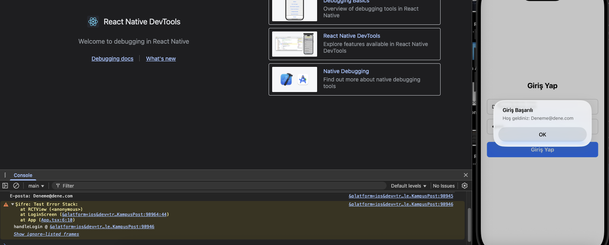

# KampusPost – React Native Projesi (Ödev 2)

Bu repo, BGP 201 dersi kapsamında geliştirilen **KampusPost** adlı React Native uygulamasının ilk adımını içerir.  
Amaç: Giriş ekranı, form bileşenleri ve temel navigasyon yapısını oluşturmak.

---

##  Kurulum Gereksinimleri

Aşağıdaki yazılımlar sisteminizde kurulu olmalıdır:

- Node.js (LTS sürüm)
- VS Code veya başka bir IDE
- React Native CLI ortamı
- Android Studio + AVD (emülatör)
- JDK 17 (Adoptium Temurin önerilir)

> Ortam değişkenleri: `JAVA_HOME` ve `ANDROID_HOME` doğru ayarlanmalı  
> Android SDK araçları yüklü olmalı

---

##  Projenin Oluşturulması ve Çalıştırılması

npx @react-native-community/cli@latest init KampusPost
cd KampusPost
npx react-native run-android
# veya
npx react-native run-ios

## Ekran Görüntüleri

### Ana Ekran

### Klasör Yapısı

### Uygulama Açıldı

### Giriş Ekranı

### Giriş Formu

### Konsol Çıktısı

